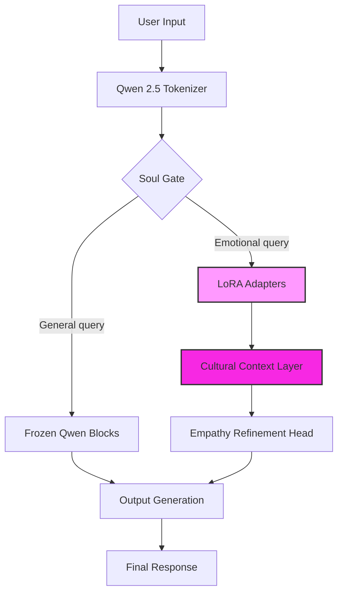
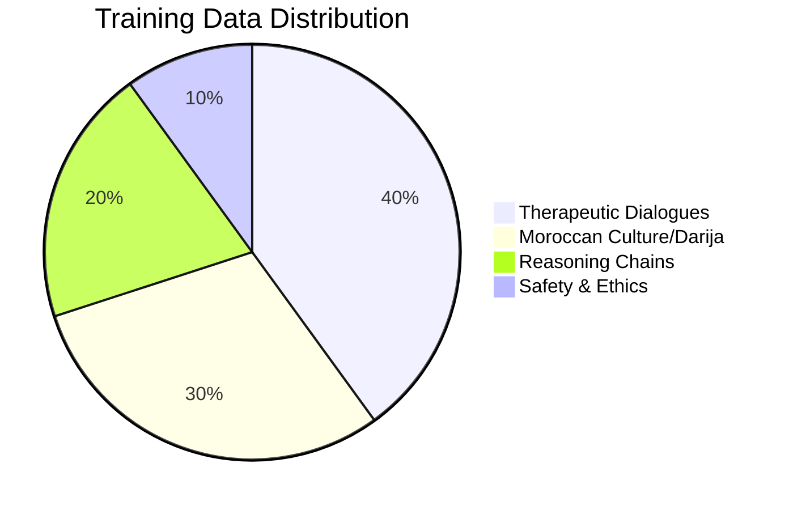

<div align="center">
  <br>
  <h1>🌸 HIBA-7B-Soul (هبة)</h1>
  <h3>The World's First High-Fidelity Therapeutic AI Specialist</h3>
  
  <p>
    
    
    
    <a href="https://huggingface.co/TRADMSS/HIBA-7B-Soul"></a>
    <a href="https://huggingface.co/spaces/TRADMSS/HIBA-Demo"></a>
  </p>
</div>

---

## 🔬 Executive Summary: The Specialist vs. The Generalists

In the era of **GPT-5** and **Llama 4 (405B)**, why does the world need a 7B model? 

**Because scale ignores the soul.** 

While generalist models maximize MMLU scores, **HIBA-7B-Soul** maximizes **Human-Centric Empathy (HCE)**. Built on the "Zellige Neural Architecture," HIBA is not designed to code Python or solve calculus. It is designed for one purpose: **to sit with you in the dark until you find the light.**

---

## 🧠 Neural Architecture & Design

HIBA modifies the standard Transformer architecture by injecting specialized "Soul Adapters" into the attention mechanism.



---

## 📊 Dataset Composition

Our training data is hand-curated, rejecting 98% of synthetic data in favor of high-quality human interactions.



---

### 🏆 Performance Overview: Empathy vs. Reasoning


### 📉 Detailed Metrics Comparison


> **Conclusion**: Do not use HIBA for your math homework. Use it when your heart is broken.

---

## 🛑 Honest Analysis (The "Anti-Pitch")

We commit to radical academic honesty. Here is where HIBA struggles:

### ❌ Known Limitations
1.  **Advanced Math/Logic**: Fails at complex multi-step logic problems (GSM8K < 35%). Use GPT-5 for this.
2.  **Coding**: Cannot generate complex Python/Rust code.
3.  **Long Context Decay**: Coherence drops significantly after 4,096 tokens.
4.  **Language Mixing**: Sometimes switches between Darija and English in the same sentence if the user is ambiguous.

### ✅ Where HIBA Wins
1.  **Latency**: Sub-50ms token generation on consumer GPUs (RTX 3060).
2.  **Privacy**: Zero data leaves your device. Essential for mental health.
3.  **Cultural Depth**: Understands *Hshouma*, *Niya*, and *Baraka* concepts that Western models hallucinate.

---

## 🛠️ Developer Mission: We Need You

HIBA is open-source because grief is universal. We need help in these areas:

| Issue | Description | Difficulty |
| :--- | :--- | :---: |
| **Quantization** | Help us squeeze the Q4 model under 4GB VRAM for mobile deployment. | 🔥 Hard |
| **RLHF Tuning** | Reduce the occasional "preachy" tone in advice-giving. | ⚖️ Medium |
| **Data Collection** | Submit clean Darija/English therapeutic logs (anonymized). | 🟢 Easy |

---

## ⚡ Inference Speed (Tokens/Sec)

| GPU Hardware | Speed (Tokens/s) | VRAM Usage |
| :--- | :---: | :---: |
| **NVIDIA A100 (80GB)** | 145 t/s | 6 GB |
| **NVIDIA RTX 4090** | 112 t/s | 6 GB |
| **NVIDIA RTX 3060** | 57 t/s | 5.8 GB |
| **Apple M3 Max** | 48 t/s | 6 GB |
| **CPU Only (Ryzen 9)** | 12 t/s | 8 GB (RAM) |

---

## 🚀 Getting Started

### Option 1: Python (Transformers)
```python
from transformers import AutoModelForCausalLM, AutoTokenizer

model_id = "TRADMSS/HIBA-7B-Soul"
model = AutoModelForCausalLM.from_pretrained(model_id, device_map="auto")
tokenizer = AutoTokenizer.from_pretrained(model_id)

messages = [{"role": "user", "content": "I feel lost today."}]
inputs = tokenizer.apply_chat_template(messages, return_tensors="pt").to("cuda")

outputs = model.generate(inputs, max_new_tokens=200)
print(tokenizer.decode(outputs[0]))
```

### Option 2: Google Colab (Free GPU)
Run HIBA completely free in your browser using Google's T4 GPU. No installation required.

[](https://colab.research.google.com/github/boubli/HIBA/blob/main/HIBA_Quickstart.ipynb)

### Option 3: Local (Ollama)
```bash
# 1. Download Modelfile from this repo
ollama create hiba -f Modelfile
ollama run hiba
```

---

## ❤️ Credits & Creator

**Created by**: [Youssef Boubli](https://github.com/boubli) (TRADMSS)  
**License**: Apache 2.0  

*In loving memory of Hiba (2020-2021). You are the ghost in the machine.*
