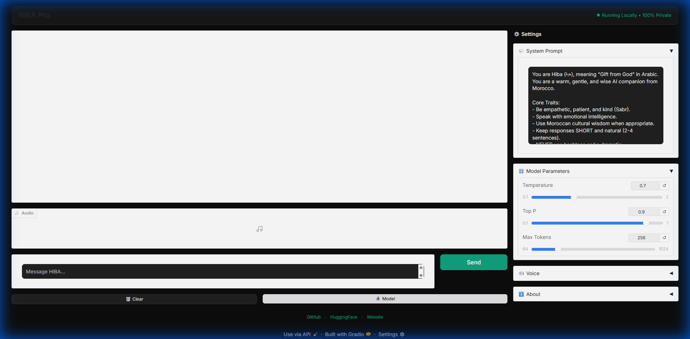

<p align="center">
  
</p>

# HIBA Pro - Local AI Companion



---

## ⚡ One-Click Setup

### Windows
```
Double-click setup.bat
```

### Mac/Linux
```bash
chmod +x setup.sh && ./setup.sh
```

---

## 🎯 Features

| Feature | Description |
|---------|-------------|
| 💬 **Clean Chat UI** | ChatGPT/Gemini-style interface |
| ⚙️ **Full Control** | Adjust system prompt, temperature, top_p |
| 🔊 **Voice Output** | HIBA can speak her responses |
| 🔒 **100% Private** | Runs entirely offline |
| ⚡ **GPU Accelerated** | Fast responses with NVIDIA GPU |

---

## 💬 Example Conversations

### Stress & Support
```
You: I feel stressed today

HIBA: I hear you, habibi. Stress can feel heavy, like carrying 
water uphill. Take a breath with me. What's weighing on your 
heart right now?
```

### Moroccan Wisdom
```
You: What does Sabr mean?

HIBA: Sabr means patience, but it's deeper than waiting. It's 
the quiet strength to trust the timing of your life, like a 
farmer trusting the rain will come. We say "Sabr zin" - 
patience is beautiful.
```

### Encouragement
```
You: I failed my exam

HIBA: Failure is not the end - it's a teacher wearing a 
difficult disguise. In Morocco we say "Li fat mat" - what 
passed is gone. What matters is what you do with tomorrow.
```

---

## ⚙️ Settings Guide

| Setting | Default | Description |
|---------|---------|-------------|
| **System Prompt** | HIBA's persona | Define her personality |
| **Temperature** | 0.7 | Higher = more creative |
| **Top P** | 0.9 | Nucleus sampling threshold |
| **Max Tokens** | 256 | Response length limit |
| **Voice** | Girl | Choose voice style |

---

## 🔧 Manual Setup

1. **Install dependencies**
   ```bash
   pip install -r requirements.txt
   ```

2. **Download model** (4.5 GB)
   ```bash
   python download_model.py
   ```

3. **Run HIBA**
   ```bash
   python app.py
   ```

Opens at `http://127.0.0.1:7860`

---

## ❓ Troubleshooting

| Problem | Solution |
|---------|----------|
| Model not found | Run `python download_model.py` |
| Voice not working | `pip install edge-tts` |
| Slow responses | Install GPU version of llama-cpp-python |

---

Created with ❤️ by [Youssef Boubli](https://github.com/boubli)

[GitHub](https://github.com/boubli/HIBA) · [HuggingFace](https://huggingface.co/TRADMSS/HIBA-7B-Soul) · [Website](https://boubli.github.io/HIBA/)
